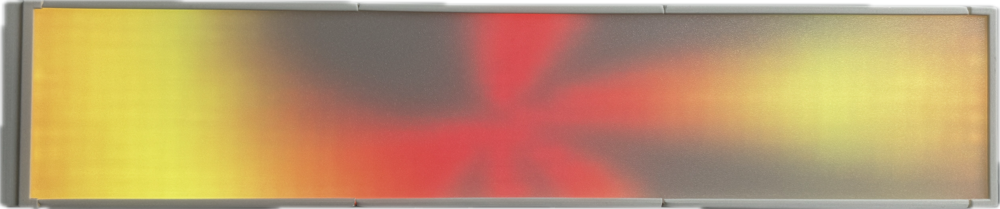
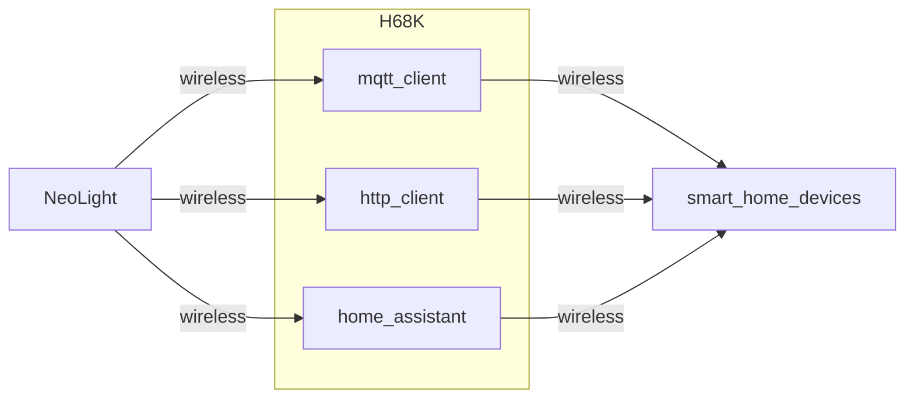

## NeoLight



### 视频URL

https://www.bilibili.com/video/BV1FqVVeAEYX/?spm_id_from=333.999.list.card_archive.click&vd_source=e5ca4904bafd868311ee478730880b10

### 机械加工

- 根据mechanic文件夹中的模型3D打印文件，并加工铝板
- 灯带使用WS2812B，100pixels/meter

### 硬件加工

- 根据hardware文件夹中的文件打板（注意：目前有一路5V输出带载后压降过高，需要重新Layout）

### 网络环境搭建



### 代码运行

```bash
pip install -r requirements.txt
python4 neolight.py
```

### 用到的开源项目

**详细参考requirements.txt**

- WLED

https://kno.wled.ge/

https://install.wled.me/

- Mediapipe

https://developers.google.com/mediapipe

https://github.com/google/mediapipe

- transitions

https://github.com/google-ai-edge/mediapipe